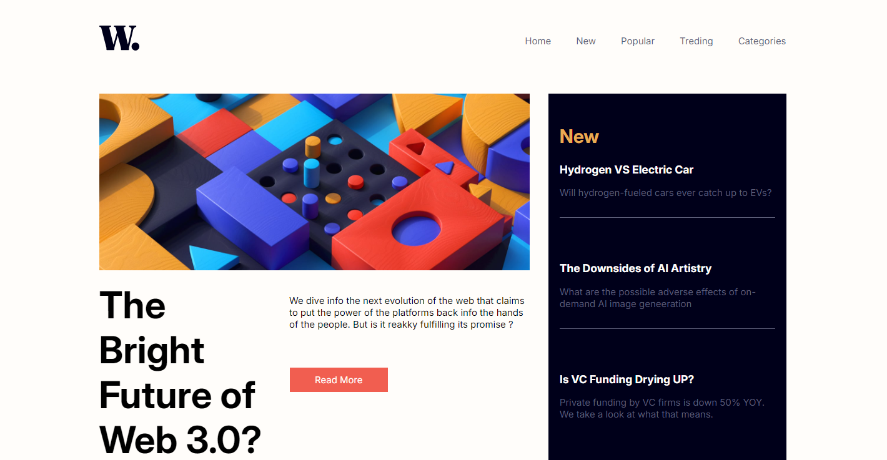
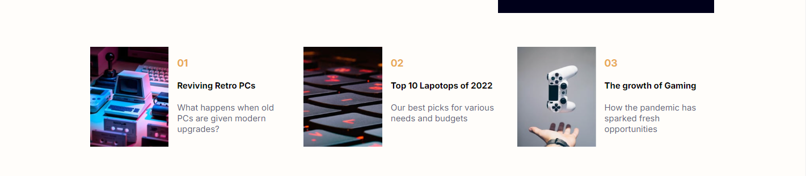

# Homepage
Bu proje temel düzeyde HTML ve CSS ile oluşturulmuştur.

Proje ile ilgili görsel ve kaynaklar [Frontend-Mentor](https://www.frontendmentor.io/solutions/interactive-news-homepage-created-using-javascript-Wy8vrbepPk) sayfasından alınmıştır.

## Proje Görselleri

## Proje'nin Linki
[Homepage](https://homepage-can-demo.netlify.app/)